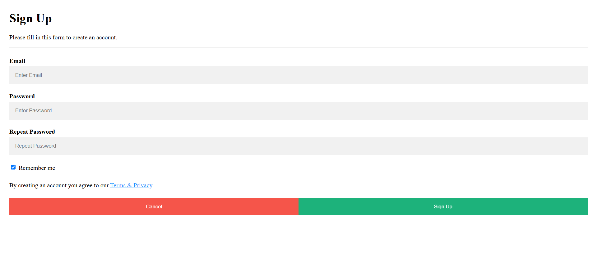
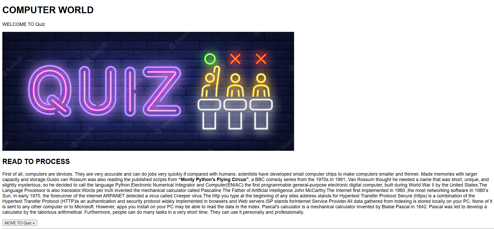
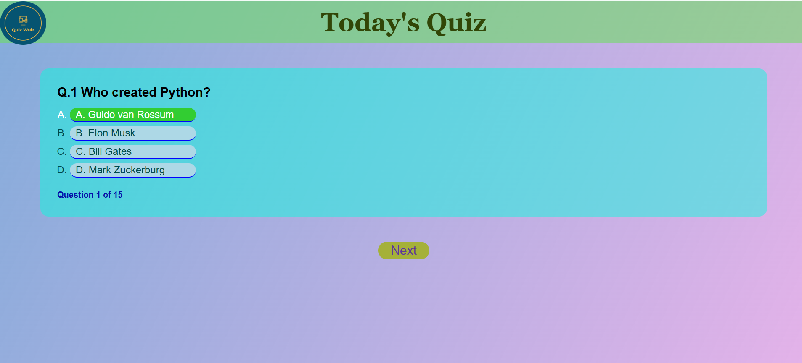
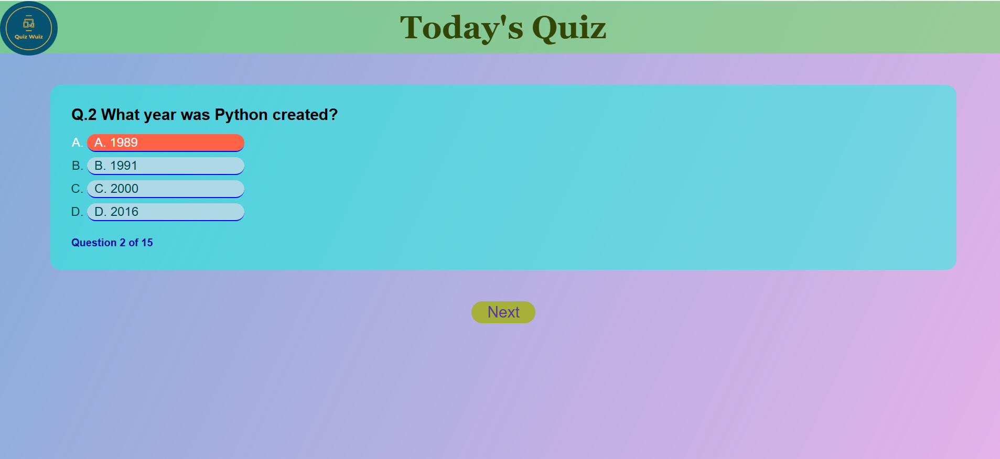
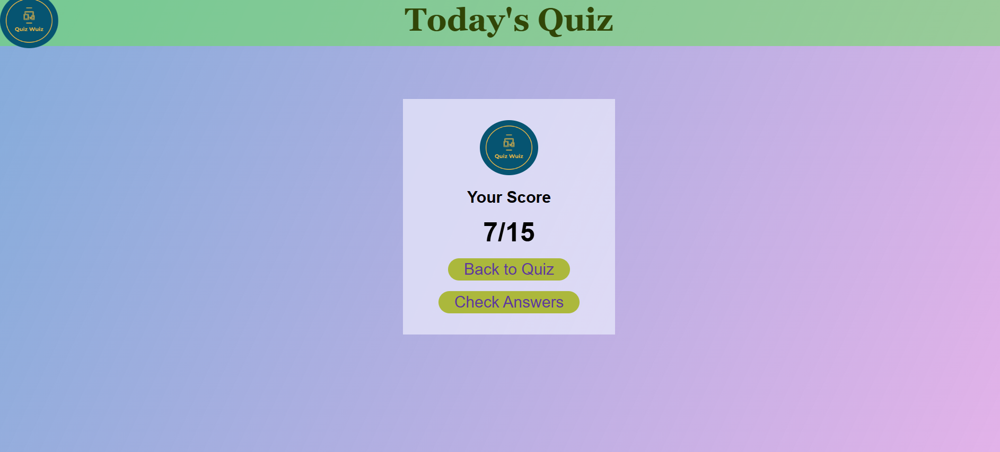

# Online Quiz

## Introduction

The Quiz Application is a web-based platform designed for users to test their knowledge on various topics through a series of questions. The application allows users to take quizzes, view results, and track their progress over time.

## Features

- User-friendly interface to navigate quizzes easily.
- Multiple-choice questions.
- Score tracking for each quiz attempt.
- Responsive design to support various devices (mobile, tablet, desktop).
- Option to review incorrect answers after quiz completion.

## Technologies Used

- HTML
- CSS
- JavaScript

## Screenshots

Here are some screenshots of the application:

